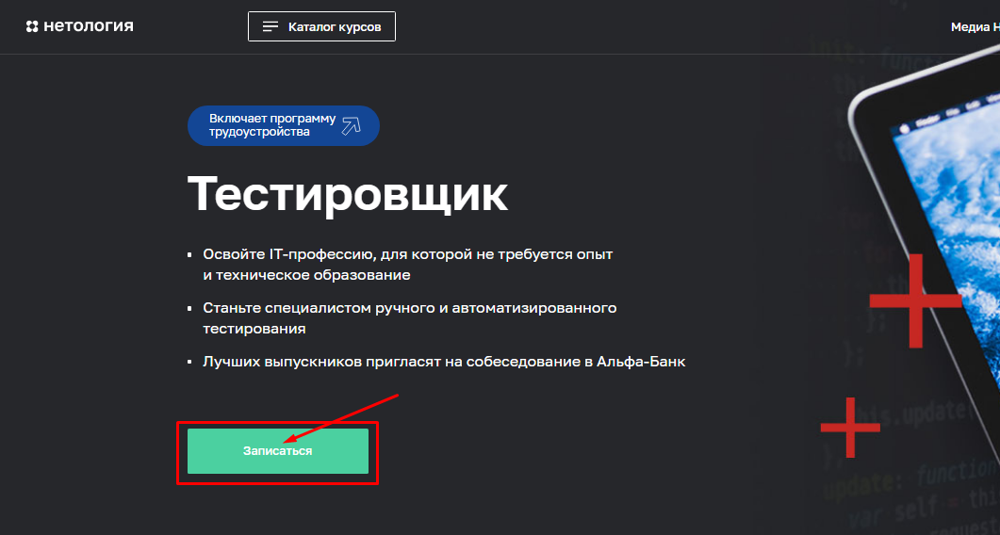

# # План автоматизации тестирования формы заявки на обучение профессии "Тестировщик ПО" на веб-сайте [Нетологии](https://netology.ru/)

## 1. Перечень автоматизируемых сценариев

*Сценарий 1:* Переход на форму заявки через меню "Каталог курсов:"

### Шаги воспроизведения: 
1. Открыть главную страницу [Нетологии](https://netology.ru/);
2. В верхнем меню сайта нажать "Каталог курсов"

3. В выпадающем меню выбрать раздел "Программирорвание" и далее "Тестировщик ПО";

4. На открывшейся странице нажать кнопку "Записаться";

5. Вводим валидные Имя, Телефон и email в соответствующие поля (например, "Андрей", "+79266837729", aovchin@gmail.com);
6. Нажимаем кнопку "Записаться";
7. Появляется страница с текстом "Вы записались на курс"

### Шаги воспроизведения: 
1. Открыть главную страницу [Нетологии](https://netology.ru/);
2. В верхнем меню сайта нажать "Каталог курсов"

3. В выпадающем меню выбрать раздел "Программирорвание" и далее "Тестировщик ПО";

4. На открывшейся странице нажать кнопку "Записаться";

5. Вводим валидные Имя, Телефон и email в соответствующие поля (например, "Андрей", "+79266837729", aovchin@gmail.com);
6. Нажимаем кнопку "Получить консультацию";
7. Появляется сообщение с текстом "В ближайшее время с вами свяжется менеджер"

*Сценарий 2:* Преход на форму заявки через анимированное меню "НЕО для начинающих"

### Шаги воспроизведения: 
1. Открыть главную страницу [Нетологии](https://netology.ru/);
2. В анимированном меню сайта нажать "НЕО для начинающих"

3. Справа в фильтре выбрать направление и установить чек-бокс напротив "Программирование"
4. В разделе "Лучшие курсы для старта" выбрать "Тестировщик ПО";

5. На открывшейся странице нажать кнопку "Записаться";

6. Вводим валидные Имя, Телефон и email в соответствующие поля (например, "Андрей", "+79266837729", aovchin@gmail.com);
7. Нажимаем кнопку "Записаться";
8. Появляется страница с текстом "Вы записались на курс"

### Шаги воспроизведения: 
1. Открыть главную страницу [Нетологии](https://netology.ru/);
2. В верхнем меню сайта нажать "Каталог курсов"

3. В выпадающем меню выбрать раздел "Программирорвание" и далее "Тестировщик ПО";

4. На открывшейся странице нажать кнопку "Записаться";

5. Вводим валидные Имя, Телефон и email в соответствующие поля (например, "Андрей", "+79266837729", aovchin@gmail.com);
7. Нажимаем кнопку "Получить консультацию";
8. Появляется сообщение с текстом "В ближайшее время с вами свяжется менеджер"

**Основные поля для проверки валидных и невалидных данных** 

**Поле Имя** 
Рассмотрим позитивные и негативные сценарии.
*Предусловие* в поле "Телефон" необходимо указать валидный номер (+79266837729) 

Позитивные сценарии: 
1. Заявка должна отправляться, если поле "Имя" заполнено корректно (например, "Андрей");
2. Заявка должна отправляться, если поле "Имя" содержит имя с маленькой буквы (например, "андрей");

Негативные сценарии:
1. Заявка не должна отправляться, если поле "Имя" пустое;
2. Заявка не должна отправляться, если в поле "Имя" введены данные на английском языке (например, "Andrei");
3. Заявка не должна отправляться, если в поле "Имя" введены некорректные символы "*&^%$#@*" ;
4. Заявка не должна отправляться, если в поле "Имя" введны цифры;

**Поле Телефон** 
Рассмотрим позитивные и негативные сценарии.
*Предусловие* в поле "Имя" необходимо указать валидные данные (например, "Андрей");

Позитивные сценарии:
1. Заявка должна отправляться, если поле "Мобильный телефон" содержит 11 цифр и начинается с кода +7 (например, "+79266837729")

Негативные сценарии:
1. Заявка не должна отправляться, если поле "Мобильный телефон" пустое;
2. Заявка не должна отправляться, если в поле "Мобильный телефон" введено меньше 11 цифр (например, "+7 926 683");
3. Заявка не должна отправляться, если в поле "Мобильный телефон" введено больше 11 цифр (например, "+792668377292929");
4. Заявка не должна отправляться, если в поле "Мобильный телефон" введены некорректные символы "~!@#$%^&*";
5. Заявка не должна отправляться, если в поле "Мобильный телефон" введены текстовые символы.

## 2. Перечень используемых инструментов

**IntelliJ IDEA** - очень удобный и функциональный редактор кода. Обладает всеми возможными инструментами для комфортной работы, а также подсказками, позволяющие ускорить процесс разработки.

**Java 11** - язык программирования. На базе которого будет строиться будущей проект.

**Git**  — распределённая система контроля версий, которая даёт возможность разработчикам отслеживать изменения в файлах и работать над одним проектом совместно с коллегами.

**JUnit-5** - Тестовый фрейворк для авто-тестов, содержит необходимую библиотеку с кодами для тестирования.

**Gradle** — система автоматической сборки, которую используют для упрощения работы с Java.

**Selenide** - Тестовый фреймворк, в основе которого лежит Selenium. Хорошо подходит для тестирования веб-приложений, сокращая большое кол-во кода в тестах.

**Allure** – фреймворк для создания понятных и простых отчетов автотестов.

**Lombok** – библиотека, позволяющая сократить количество написанного кода, улучшая читаемость.

## 3. Перечень необходимых разрешений/данных/доступов 
1. Разрешение на тестирование формы (возможно тестовая версия сайта).

## 4. Перечень и описание возможных рисков при автоматизации
1. Если будет проверяться основной рабочий сайт, то есть вероятность перегрузки сервера.
2. На написание автотестов требуется время и поддержка их в актуальном состоянии.

## 5. Перечень необходимых специалистов для автоматизации
С данной работой может справиться один специалист из отдела QA, обладающий навыками работы с указанными выше инструментами.

## 6. Интервальная оценка с учётом рисков (в часах)
- Написание автотестов – 5-7 часов.
- Проведение тестирования – 3-5 часов.
- Подготовка отчёта о тестировании – 2-3 часа.